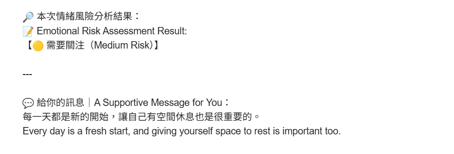

# Project Title
## SOULSCAN
An AI-Porewed mental wellness companion

# Project Description
Modern people are often in high-pressure situations, but lack the time or awareness to face their own mental state.  
This project aims to provide a **low-threshold, non-invasive** way for users to reflect on their emotions and receive personalized suggestions using AI.

We designed an indirect psychological questionnaire using **Google Forms**, asking questions like:
- "What color represents your week?"
- "If your feeling today was a weather type, what would it be?"

After users submit their responses, we apply **LLMs (OpenAI GPT)** and **NLP techniques** to analyze the text, determine psychological tendencies (e.g., stress, calmness, burnout), label mental states, and generate warm and concise feedback.

# Getting Started
## Requirements
- Python (via Google Colab)
- OpenAI API Key
- Google Forms response

[code](Soulscan_with_Chatbot.ipynb)

# File Structure
- Soulscan_with_Chatbot.ipynb        ← Main notebook for data analysis & response generation
- [Soulscan - Survey.csv ](https://docs.google.com/forms/d/e/1FAIpQLSdQ4ccy-rdZMXRsHFgb98NMidGsLpApG1MZ5dAp7IIJo4W3Ew/viewform)             ← Data input format
- README.md                          ← This file

# Analysis
This project utilizes a combination of **Google Sheets API**, **OpenAI GPT (LLM)**, and basic email automation to analyze emotional indicators and deliver personalized suggestions.

## Tools & Libraries
- `OpenAI` – for both custom fine-tuned GPT-3.5 (情緒風險判斷) and regular GPT-3.5 (鼓勵語生成)
- `gspread` + `oauth2client` – access and read Google Sheets responses directly
- `schedule`, `smtplib` – for automated email delivery

## Model Usage
- **Custom Fine-Tuned GPT-3.5**
  - Used to classify the user's emotional state into:
    - `low_risk`
    - `medium_risk`
    - `high_risk`
  - Model prompt includes a specific system role: *"You are a warm, patient counseling assistant..."*
- **Regular GPT-3.5**
  - Generates a concise encouragement message based on user's psychological metaphors

### Pipeline Flow
1. **User submits questionnaire** (Google Form)
2. **Responses are stored** in Google Sheets
3. **Script fetches the data** via Google Sheets API
4. Each response is:
   - Sent to the **fine-tuned GPT model** for risk classification
   - Sent to the **general GPT model** for suggestion generation
5. A custom **email message is constructed** and sent to the user, including:
   - Their submitted answers
   - Risk classification result
   - Encouragement text
   - Contact information of the counseling center
   
### Result

# Results
- The **fine-tuned GPT model** effectively distinguishes emotional tones from metaphorical language (e.g., colors, weather, symbols).
- Users receive feedback in an empathetic and emotionally safe format, which increases their willingness to engage.
- Deployment confirmed the model could process multiple responses, classify risk, and generate meaningful responses within seconds.
- Initial user feedback (from testers) highlighted:
  - Increased emotional self-awareness
  - Appreciation for gentle, non-invasive delivery style
  - Clearer intent to reflect or seek help

# Contributors
HSUEH,CHUI-YUAN	110301078
Sherley Laibhen	111305048
YANG,HSIANG-CHI	110ZU1011
